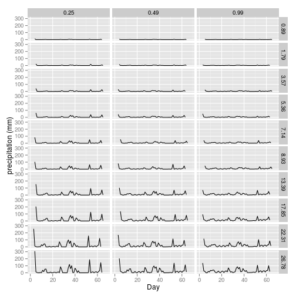

# Precipitation manipulation experiments -- diagnostics and illustrations

**This document is for Colombia**

The schedule for the precipitation experiment is based on rainfall data for our local sites.  This document will illustrate the process of calculating schedules from rainfall data.  A modified version of this document could be a useful supplementary material for our eventual papers.  In the meantime it will help us understand how the code works in the first place.

## Fitting the Negative Binomial distribution to raw rainfall data
 

This graph shows the frequency distribution of rainfall amounts for all the years in the data you submitted.  Rainfall amount is on the x-axis (in millimeters) and the number of days is on the y-axis.  

We fit a Negative Binomial distribution to this data.  This is a several-step process:

1. Round rainfall amounts to integers
2. Estimate *mu* and *k* for each year of the dataset using maximum likelihood
3. average these parameters to produce the "average distribution"

This average distribution is shown in black against all the raw data, which is shown in colour.  You can see that it fits rather well -- except for the long tail, which predicts <1 day for many of the large rainfall amounts.

## "integerizing" the distribution.
 

This figure shows the negative binomial prediction (as above).  However, it cannot be used directly because it predicts non-integer frequencies for each rainfall amount (and of course we cannot water for a non-integer number of days!).  We came up with an 'integerization' algorithim which approximates this smooth line with the discrete points shown here. The algorithim works like this: when we round the non-integer frequencies of rainfall amounts to round numbers, we either increase or decrease by a small amount (<1).  We add together the "leftovers", until we get a quantity equal to one.  We multiply each "leftover" by its rainfall amount, and add them together.  

The above figure shows that the resulting integers are OK (not perfect) at fitting the nice, smooth negative binomial line.

## altering the parameters -- applying the experimental treatment
 

Each panel represents the distribution of days within one treatment (bromeliad).  Rows are variation in the *mu* parameter, while columns are *k*.  These are the treatments which we decided on as a group: increases & decreases in the two parameters of the distribution. 

## patterning the rainfall appropriately
 

The temporal pattern of rain in each bromeliad -- equal to the previous figure but with the addition of a sequence of rainfall that approximates the variation natural to the site.

## Temporal patterns determined in this way are indistinguishable from nature
 

 

